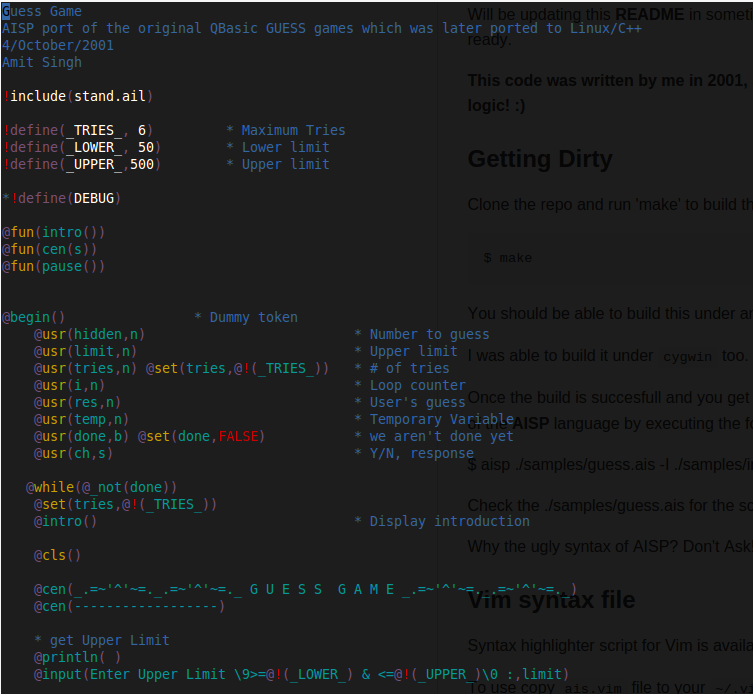

### May 5th 2012
Recently found this code lying in on my old backup CD's.

Have got it compiling under cygwin and CentOS.

Will be updating this **README** in sometime once I've gotten back the manual/help files for this project ready.

**This code was written by me in 2001, so please ignore all the violent code style and irritating logic! :)**

### Getting Dirty
Clone the repo and run 'make' to build the executable 'aisp'

```bash
$ make
```

You should be able to build this under any Linux machine with `gcc/g++` installed.

I was able to build it under `cygwin` too.

Once the build is succesfull and you get the executable `./aisp` (`aisp.exe` under cygwin)
Get a taste of the **AISP** language by executing the following

$ aisp ./samples/guess.ais -I ./samples/include

Check the ./samples/guess.ais for the script that was executed by the interpreter.

Why the ugly syntax of AISP? Don't Ask!

### Vim syntax file
Syntax highlighter script for Vim is available inside `misc/syntax/vim` folder.

To use copy `ais.vim` file to your `~/.vim/syntax/` folder
And put following lines in your `.vimrc` file

```vimrc
    au BufRead,BufNewFile *.ais set filetype=ais
    au BufRead,BufNewFile *.ail set filetype=ais
```

**This how the code highlited on my system**


